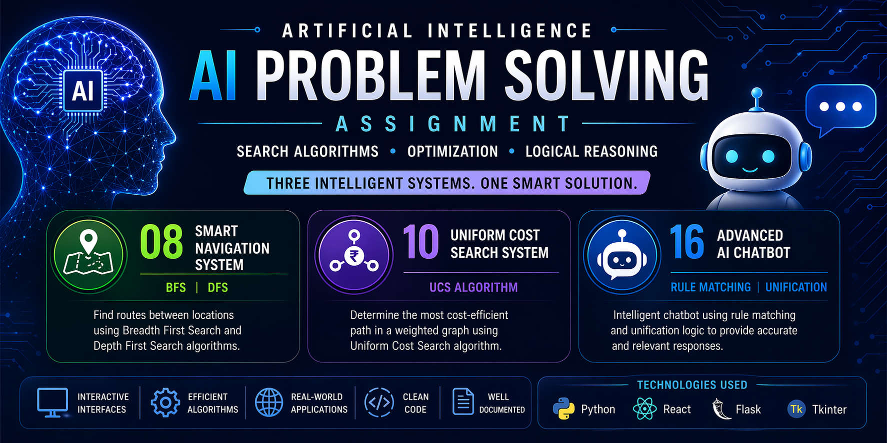

# 🤖 AI Problem Solving Assignment

### Intelligent Systems using Search Algorithms, Optimization & Logical Reasoning

<p align="center">
  
</p>

<p align="center">
  
  
  
  
  
</p>

---

# 📌 Repository Information

* **Repository Name:** `AI_ProblemSolving_<RA2411026050111>`
* **Course:** Artificial Intelligence
* **Assignment Type:** Problem Solving using AI Techniques
* **Team Members:**

  * Name : Rahul Siva Sai

---

# 🎯 Project Objective

The purpose of this repository is to implement and demonstrate real-world applications of Artificial Intelligence algorithms through interactive software systems.

This project focuses on three important domains:

* **Graph Navigation** using search algorithms
* **Cost Optimization** using informed search
* **Human-Computer Interaction** using logical reasoning

Each system is designed with a user-friendly interface, modular code structure, and practical outputs.

---

# ✅ Implemented Problem Statements

| Problem No | Title                            | AI Technique               |
| ---------- | -------------------------------- | -------------------------- |
| 08         | Smart Navigation System          | BFS, DFS                   |
| 10         | Uniform Cost Search System       | UCS                        |
| 16         | Advanced AI Chatbot Logic Engine | Rule Matching, Unification |

---

# 📂 Repository Structure

```text id="3yvvv8"
AI_ProblemSolving_<YourRegisterNumber>/
├── Problem08_Smart_Navigation_System/
│   ├── src/
│   ├── requirements.txt
│   └── README.md
│
├── Problem10_Uniform_Cost_Search_System/
│   ├── modules/
│   ├── requirements.txt
│   └── README.md
│
├── Problem16_Advanced_Chatbot/
│   ├── frontend/
│   │   └── client_app/
│   ├── backend/
│   ├── database/
│   └── README.md
│
├── assets/
│   ├── banner.png
│   └── logo.png
│
├── LICENSE
└── README.md
```

---

# 🚀 Implemented Systems

---

# 🔹 Problem 08 – Smart Navigation System

## 📖 Description

A route-finding system that identifies paths between locations using graph traversal techniques similar to map navigation systems.

## 🧠 Algorithms Used

* Breadth First Search (BFS)
* Depth First Search (DFS)

## ✨ Key Features

* Dynamic graph creation
* Add nodes and edges interactively
* Path search between source and destination
* Compare BFS and DFS results
* Explored nodes statistics

## ▶️ Run

```bash id="xx0w5t"
cd Problem08_Smart_Navigation_System/src
python gui.py
```

---

# 🔹 Problem 10 – Uniform Cost Search System

## 📖 Description

A cost-based decision system that computes the most efficient path in a weighted graph where each edge has a travel cost.

## 🧠 Algorithm Used

* Uniform Cost Search (UCS)

## ✨ Key Features

* Weighted graph creation
* Dynamic edge insertion
* Optimal least-cost path calculation
* Total path cost display
* Nodes explored count
* Reset graph option

## ▶️ Run

```bash id="1sdv4c"
cd Problem10_Uniform_Cost_Search_System/modules
python cost_based_gui.py
```

---

# 🔹 Problem 16 – Advanced AI Chatbot Logic Engine

## 📖 Description

An intelligent chatbot that answers user queries using predefined knowledge rules and logical unification techniques.

## 🧠 Algorithms Used

* Rule Matching
* Unification Algorithm

## ✨ Key Features

* Modern React frontend
* Flask backend API
* Interactive chat interface
* Rule-based intelligent responses
* Responsive UI design
* Easy deployment

## ▶️ Run Backend

```bash id="0chx2g"
cd Problem16_Advanced_Chatbot/backend
pip install -r requirements.txt
python app.py
```

## ▶️ Run Frontend

```bash id="wn76pw"
cd Problem16_Advanced_Chatbot/frontend
npm install
npm run dev
```

---

# 🛠️ Technologies Used

## Languages

* Python
* JavaScript
* HTML
* CSS

## Libraries / Frameworks

* Tkinter
* Flask
* Flask-CORS
* React
* Vite

---

# 📦 Requirements

## Problem 08

```txt id="5kqf4w"
tk
```

## Problem 10

```txt id="2v9n8x"
tk
```

## Problem 16

```txt id="v0d9ch"
flask
flask-cors
```

---

# 📊 Learning Outcomes

Through this assignment, the following AI concepts were practically implemented:

* Uninformed Search Techniques
* Informed Search / Cost Optimization
* Logical Reasoning Systems
* Rule-Based Decision Making
* Graph Data Structures
* GUI and Web Application Development

---

# 🔮 Future Enhancements

* Real-time map visualization
* Voice-enabled chatbot
* Database-based memory system
* User authentication
* Cloud deployment
* Improved UI/UX design

---

# ✅ GitHub Submission Checklist

* ✔ Public Repository
* ✔ Proper Folder Structure
* ✔ Three Problem Statements Implemented
* ✔ README.md Documentation
* ✔ Meaningful Commits
* ✔ Executable Programs
* ✔ Modular Code Structure

---

# 🏁 Conclusion

This repository successfully demonstrates the practical implementation of core Artificial Intelligence techniques through three interactive systems. The project combines theory with application and highlights how AI can solve navigation, optimization, and communication problems efficiently.

---

# 👨‍💻 Authors

* Name : Rahul Siva Sai

---

# ⭐ Acknowledgement

Submitted as part of the **Artificial Intelligence Problem Solving Assignment**.
